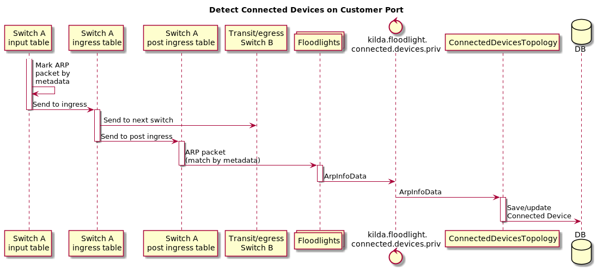
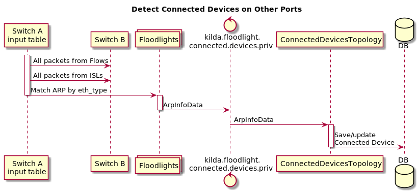
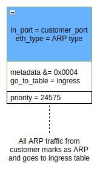
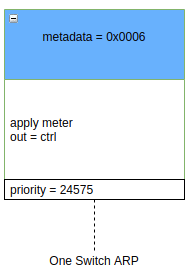
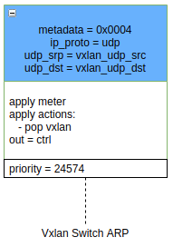
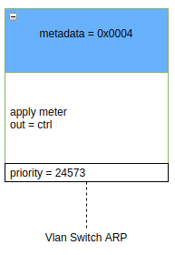
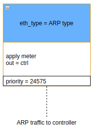
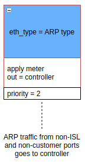
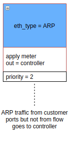

# Switch connected devices via ARP 

## Summary

This feature allows to detect devices connected to particular switch
by catching ARP packets. Design of the feature is based on multi-table feature design and
connected devices via LLDP feature design.

## API

New boolean field `switch_arp` will be added to switch properties.
After setting it to `true` by API `PUT /{switch-id}/properties` several rules will be installed on the switch.
Description of these rules you can find in section `Detecting of connected devices via ARP`.

As switch ARP feature is based on multi-table feature user can't set `switch_arp` property to `true`
without setting `multi_table` to `true`. Bad request will be returned otherwise.

V2 API `GET /{switch_id}/devices?since={time}` will be updated.

New field `arp` will be added to each port entity. This field will contain list of devices
connected to port which were detected by ARP packets.

Each device will have following fields:

* `vlan`
* `macAddress`
* `ipAddress`
* `timeFirstSeen`
* `timeLastSeen`

Also each device will have optional field `flowId`. 
This field will be set if ARP packet belongs to a flow. 

Updated API response will be look like:

~~~
{
  "ports": [
      {
         "port_number": int,
         "lldp": [{
            "vlan": int,
            "macAddress": string,
            "chassisId": string,
            "portId": string,
            "ttl": int,
            "portDescription": string,
            "systemName": string,
            "systemDescription": string,
            "systemCapabilities": string,
            "managementAddress": string,
            "flowId": string,
            "timeFirstSeen": string,
            "timeLastSeen": string
           },
           ***
         ],
         "arp": [{
            "vlan": int,
            "macAddress": string,
            "ipAddress": string,
            "flowId": string,
            "timeFirstSeen": string,
            "timeLastSeen": string
           },
           *** 
         ],
      },
      ***
   ]
}

~~~

## Detecting of connected devices via ARP

To detect connected devices via ARP we will catch ARP packets from each switch port
and send them to controller to analyze them in Connected Devices Storm Topology.

There are three types of switch ports:
1. Customer (port with created flow on it).
2. Isl
3. Other (port without ISL and without flows).
 
Rules will be different for each port type.

Full description of new rules you can find in
[this](https://drive.google.com/file/d/1keTueyvh6iDtRhO5XXxgMBV0rZFbgPoL/view?usp=sharing) doc.

Short description:






## Switch rules

There are 7 types of new rules will be introduced:
* Flow (1 rule for each flow and 3 default rules)
* Isl (1 default rule)
* Other (2 default rule)

#### Flow rules

Rule for each flow in Input Table:



```
[FLOW_ID0]
    ofp_version      = 4
    ControllerGroup  = Management
    [MATCHFIELDS]
        OFPXMT_OFB_ETH_TYPE = 0x0806 (ARP eth type) 
        OFPXMT_OFB_IN_PORT = XXX (flow input port) 
    [INSTRUCTIONS]
        [OFPIT_APPLY_ACTIONS]
             [ACTIONS]
                [OFPAT_WERITE_METADATA]
                    value = 0x0004 (mark packet as ARP)
                    mask = 0x0004
                [OFPAT_GO_TO_TABLE]
                    table_id = 2 (ingress table)

```

Rule for one switch flows in Post Ingress table:



```
[FLOW_ID0]
    ofp_version      = 4
    ControllerGroup  = Management
    [MATCHFIELDS]
        OFPXMT_OFB_METADATA = 0x0006 (packet marked as ARP and as One Switch Flow)
    [INSTRUCTIONS]
        [OFPIT_APPLY_ACTIONS]
             [ACTIONS]
                [OFPAT_OUTPUT] (sent to controller)
                    port = ctrl
                    mlen = 65535
```

Rule for vxlan flows in Post Ingress table:



```
[FLOW_ID0]
    ofp_version      = 4
    ControllerGroup  = Management
    [MATCHFIELDS]
        OFPXMT_OFB_METADATA = 0x0004 (packet marked as ARP)
        OFPXMT_OFB_IP_PROTO = UDP
        OFPXMT_OFB_UDP_SRC = vlan udp src
        OFPXMT_OFB_UDP_DST = vlan udp dst
    [INSTRUCTIONS]
        [OFPIT_APPLY_ACTIONS]
             [ACTIONS]
                [OFPAT_POP_TUNELL_ID] (pop vxlan)
                [OFPAT_OUTPUT] (sent to controller)
                    port = ctrl
                    mlen = 65535
```

Rule for other flows in Post Ingress table:



```
[FLOW_ID0]
    ofp_version      = 4
    ControllerGroup  = Management
    [MATCHFIELDS]
        OFPXMT_OFB_METADATA = 0x0004 (packet marked as ARP)
    [INSTRUCTIONS]
        [OFPIT_APPLY_ACTIONS]
             [ACTIONS]
                [OFPAT_OUTPUT] (sent to controller)
                    port = ctrl
                    mlen = 65535
```

#### ISL rules

One rule in Transit table:



```
[FLOW_ID0]
    ofp_version      = 4
    ControllerGroup  = Management
    [MATCHFIELDS]
        OFPXMT_OFB_ETH_TYPE = 0x0806 (ARP eth type) 
    [INSTRUCTIONS]
        [OFPIT_APPLY_ACTIONS]
             [ACTIONS]
                [OFPAT_OUTPUT] (sent to controller)
                    port = ctrl
                    mlen = 65535
```

#### Other rule

One rule in Input Table:



```
[FLOW_ID0]
    ofp_version      = 4
    ControllerGroup  = Management
    [MATCHFIELDS]
        OFPXMT_OFB_ETH_TYPE = 0x0806 (ARP eth type) 
    [INSTRUCTIONS]
        [OFPIT_APPLY_ACTIONS]
             [ACTIONS]
                [OFPAT_OUTPUT] (sent to controller)
                    port = ctrl
                    mlen = 65535

```

One rule in Ingress Table to catch ARP from customer ports (only packets which are not belong to any flow):



```
[FLOW_ID0]
    ofp_version      = 4
    ControllerGroup  = Management
    [MATCHFIELDS]
        OFPXMT_OFB_ETH_TYPE = 0x0806 (ARP eth type) 
    [INSTRUCTIONS]
        [OFPIT_APPLY_ACTIONS]
             [ACTIONS]
                [OFPAT_OUTPUT] (sent to controller)
                    port = ctrl
                    mlen = 65535

```
