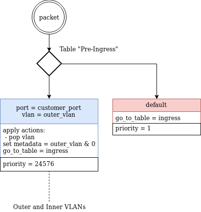
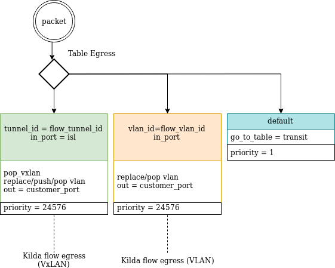
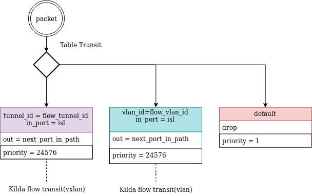

# Multi-Table Pipelines for Kilda

## Goal

Goal of this document is to describe how kilda works with switches that supports
multi-table mode.

## Kilda OF Rules

There are 4 types of rules that controller installs to the switch:
* Default Rules
* Ingress Rules
* Transit Rules
* Egress Rules 

### Default Rules

Kilda has set of default switch rules that handles telemetry and discovery process and also 
verify link consistency:

* Drop Rule - custom rule to track all unresolved or un-routable packets
* Verification Broadcast rule - catches discovery packets and passes them back to speaker
* Verification Unicast rule - catches customer flow ping packets and passes them back to speaker
* Drop Verification Loop rule - prevents flood of discovery packets among switches
* Catch BFD rule - catch bdf telemetry packets and passes them to the switch
* Round Trip Latency Rule - copies disco packets with timestamp writing and passes it back to speaker
* Verification Unicast VxLAN rule - catches customer flow ping packets for vxlan encapsulated flow

### Customer Flow Rules

Along with default rules there are 4 types that belongs to customer flows

* Ingress Flow rule - match packet by port/vlan encapsulate it with vlan/vxlan and passes to the next hop
* Single Switch Flow rule match packet by port/vlan optionally re-tag packet and pass it to customer port
* Transit Flow rule - match packet by port and (transit vlan/vxlan) and pass to the next hop
* Egress Flow rule - match packet by port and (transit vlan/vxlan) removes transit encapsulation in case of 
vxlan and optionally retags vlan, after that passes packet out to customer port

## Single-Table Mode Design

In a single-table mode all flows are being installed in table 0. This approach is very straightforward,
but at the same time doesn't allow build flexible solutions, i.e. q-n-q, applications, etc. Since all flows
are placed in a single table you couldn't properly use metadata and can suffer from table size limitations.
For mode details on single-table mode refer [Single Table Mode](SingleTableMode.pdf)

## Multi-Table Mode

To address problems of single-table mode it's proposed to split rules by tables and specify a set of additional
rules that will wire them them together. In this mode controller will operate 7 tables of the switch:
* Input table(0) - entry point for the packet
* Pre Ingress Table(1) - first table in a chain to handle customer port traffic could contain additional matches. 
* Ingress Table(2) - second table in a chain for the ingress traffic 
* Post Ingress Table(3) - last table in a chain for the ingress traffic
* Egress Table(4) - table for egress rules
* Transit Table(5) - table for transit rules 
* Applications Table(6) - table for mirroring traffic based on enabled apps for flow

Aggregated list of rules for Multi-Table Mode is available  [here](MultiTableMode.pdf).

### Input Table Rules

In multi-table mode input table(0) is responsible for doing several things:
* Provide backward compatibility for single-table mode customer flows
* Color traffic by port and pass it to proper table
* Maintain default rules

Here is a set of possible rules and it's actions that could be placed in a table(0):

#### Service Default Rules

To dispatch packet to proper tables there are should be additional set of rules:

* Ingress Pass Through rules - matches traffic by port and passes them to ingress tables.
* VxLAN Egress rule - matches traffic by eth_dst and vxlan ports and pass it directly into Egress table(VxLan shortcut)
* VxLAN Transit rule - matches traffic by in port and vxlan ports and pass it directly into Transit table(VxLan shortcut)
* Isl Vlan Egress rule - if traffic comes from ISL port but doesn't have VxLAN encapsulation, pass it to egress table for futher processing. 
NOTICE: Egress Table defaulted to passing packets down to transit. This one is made since it's impossible to figure out whether 
the switch is terminating for customer flow or transit. For details check VxLAN vs VLAN encapsulation.

#### Backward-compatibility

While process of switching to Multi-Table mode all existing flows will remain in table 0 as they are in a 
Single-Table mode. Service default rules won't steal it's traffic since they has priority lower than these rules. 

### Pre Ingress Table Rules

Pre Ingress Table could be used as a first step in ingress packets handling, notice that it's default fallback
is to pass traffic to ingress table.

 

### Ingress Table Rules

Ingress Table could be used as a second step in ingress packets handling, notice by default it drops packet.

 

### Post Ingress Table Rules

Post Ingress Table is a third table in ingress packet processing, notice by default it drops packet.

 

  
### Egress Table Rules

Egress Table contains rule to retag customer packets and remove vxlan, by default it passes packet down to Transit Table.

 

### Transit Table Rules

Transit Table pass traffic to the next switch, by default drops unmatched packets.

 
 
## Modes Change and Customer Flow migration

To migrate to Multi-Table mode operator should do the following steps for each switch:

* Enable MultiTable for the switch via NorthBound API see `PUT` `/v1/switches/{switch-id}/properties`.
* Validate switch and verify that there are no rule discrepancies
* Sync flow that goes through the switch one by one, starting from `default` flows
* Validate switch and verify that all rules are installed, check flow statistics for the traffic details.

NOTE: In case of migration from Multi-Table to Single-Table mode all the steps remain the same, except flow sync.
Operator should start migrating `non-default` flows first and finish with default ones.

To change mode of the existing switch from Single-Table to Multi-Table operator should use
switch properties endpoint in the Northbound API.

NOTE: change of the mode will cause switch sync procedure. It's responsible to create default and service rules
for the mode setup. But will not migrate customer flow to the new pipeline. 

IMPORTANT: if the switch is operating in multi-table mode and there are multi-table customer flow on it, changing
property back want remove default and service rules. Since they are required for the customer flow rules. 
 
Flow migration to from one mode to another could be achieved by various ways:
* Flow sync
* Flow update
* Flow re-route(NOTE: reroute will migrate flow only if it happens. The re-route logic assures that the current flow 
path and new one is not the same and the flow is not in up state. If the checks passes actual re-route will happen)

NOTE: default flows should be migrated to multi-table mode first.

## Implementation Details

### Isl Lifecycle Management

Refer isl service rule lifecycle management  [here](../network-discovery/ISL-FSM.png) 
 
### Database changes

For the smooth flow migration to the Multi-Table pipeline new fields were added to the `Flow`
and `PathSegment` nodes. `src_with_multi_table` and `dst_with_multi_table` are boolean flags
that are responsible for tracking information about actual state in which the flow was created
per each switch respectively. NOTE: since single switch flows doesn't have path segments in DB,
the tracking is made on the both levels.

New switch property and kilda configuration parameters are introduced and added to rest api as well.
Kilda configuration is responsible for handling newly added switches, while switch property changes
switch mode on the fly.

